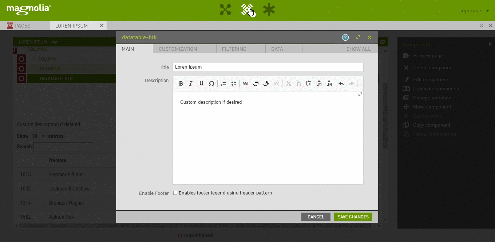
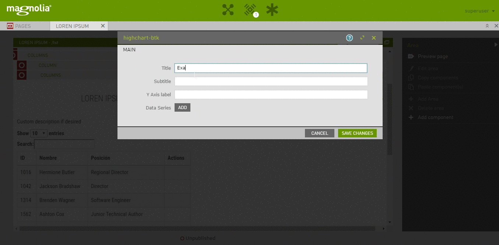
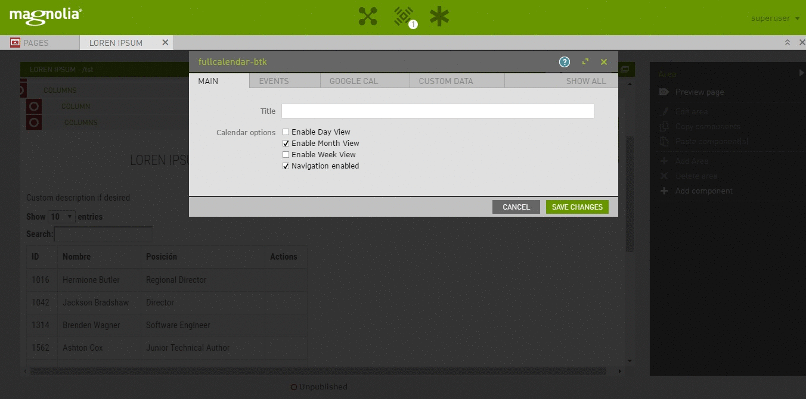
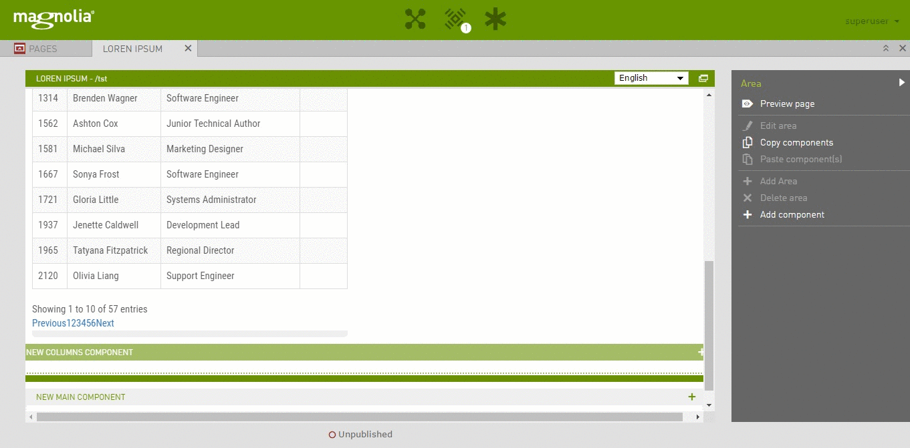

# backoffice-light-module

Imagine magnolia as a personalized backend point!
Full integration of basic business components in Magnolia: Datatables, Highcharts & Fullcalendar.io.
Download it from npm: [link](https://www.npmjs.com/package/backoffice-magnolia)

## How to install.

This is Magnolia light module project ready to use by the community. To install it,
just save this module into your light components folder as "backoffice-light-module" to fit with magnolia needs
You can see details for the demo at [Open expo presentation](http://learning.albertosoto.es/rd2017

## Features

- Extends travel-demo theme adding new components (but not dependant!)
- GridSystem components via bootstrap
- FullCalendar.io integration + custom events or google calendar customization ([link](https://fullcalendar.io/))
- Highcharts integration ([link](https://www.highcharts.com/))
- Datatables integration ([link](https://datatables.net/))
- Dependency system via bower
- Libraries included (ready to use) 
- Includes library helper for common purpose like data sending, user messaging and txt formatting (see backofficeApp.global.js)  
- Ready to use with backoffice-blossom-module for CRUD operations and dynamic data
- Design or theme independant
- Target: Personalize content in complex portals for any client, without connecting to admin central
- To be done: gulp integration and themepack
- To be done II: adapt to Vuejs

### datatable-btk
- Integrate any table from a repository using datatables. 
- Select your own custom data backend (in or out of magnolia), or choose a jcr repository for displaying it.
- Add your own headers
- Select the data you want to be rendered
- Create your custom actions, posting selected data, displaying modals o just an update
- Order any selected data in the view point as you want

### highchart-btk
- Create quick charts depending on your own data
- Ready to use with different kind of charts
- Support for several series

### fullcalendar-btk

- Custom JCR events for periods, days, or hour events
- Customize fullcalendar.io view options
- Works with your own google calendar
- Link your own event API to personalize content

### gridComponent

- Basic and easy gridcomponent via bootstrap with small footprint

## Usage

- Just copy it to your light modules repo
- See the example home page provided to know with references you must add as components
- Uses bootstrap & jquery to maximize compatibility
- Install magnolia cli to create your components

How to use in your own theme or module:

1.  Add to your target page this  'availableComponents'
- datatable-btk (id: backoffice-light-module:components/datatable-btk)
- highchart-btk (id: backoffice-light-module:components/highchart-btk)
- fullcalendar-btk (id: backoffice-light-module:components/fullcalendar-btk)
- gridComponent ( id: backoffice-light-module:components/grid)

2. To be done in your own page:
- Include macro/btk-util.ftl
- set after body start tag <@setDeferJquery openJsTags=true/>
- set before body end tag <@getJSLinks site=sitefn.site()!/>

3. Customize your theme:
- See references to /.resources/backoffice-light-module/ in 'backend-basic-theme'

4. Get in love with with backofficeApp.global.js helpers
5. Check how the blossom module works and extends it! (backoffice-magnolia) 
6. Cook with love and enjoy

## Information on Magnolia CMS

This directory is a Magnolia 'light module'.
https://docs.magnolia-cms.com

## License
MIT License (c) 2017 Alberto Soto Fernández

## Contributors
* Alberto Soto Fernandez ([github](https://github.com/albertoSoto))